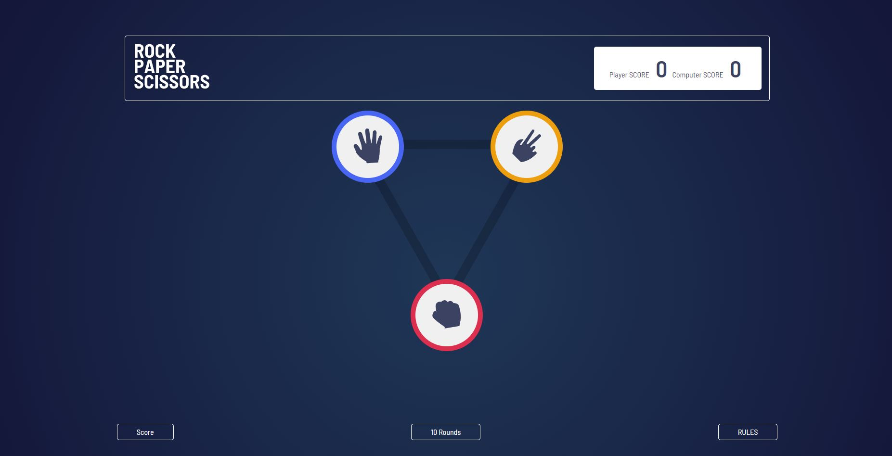
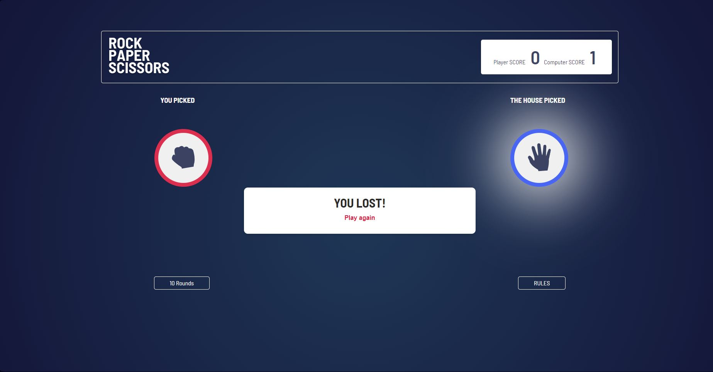
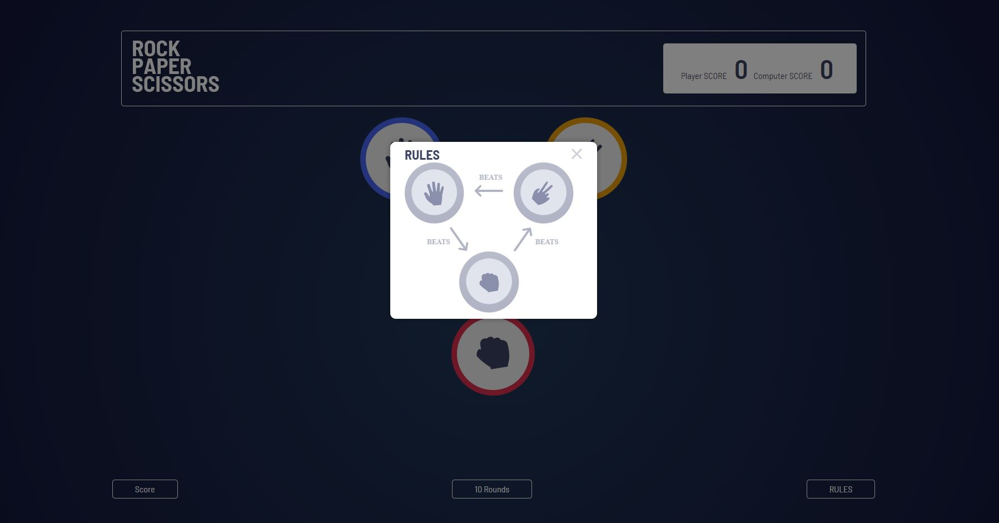
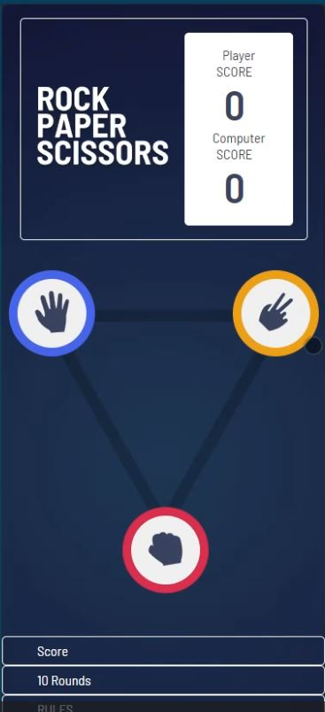

# Frontend Mentor - Rock, Paper, Scissors solution

This is a solution to the [Rock, Paper, Scissors challenge on Frontend Mentor](https://www.frontendmentor.io/challenges/rock-paper-scissors-game-pTgwgvgH). Frontend Mentor challenges help you improve your coding skills by building realistic projects. 

## Table of contents

- [Overview](#overview)
  - [The challenge](#the-challenge)
  - [Screenshot](#screenshot)
  - [Links](#links)
- [My process](#my-process)
  - [Built with](#built-with)
  - [What I learned](#what-i-learned)
  - [Continued development](#continued-development)
  - [Useful resources](#useful-resources)
- [Author](#author)
- [Acknowledgments](#acknowledgments)


## Overview

### The challenge
Your challenge is to build out this Rock, Paper, Scissors game and get it looking as close to the design as possible.
Users should be able to:

- View the optimal layout for the game depending on their device's screen size
- Play Rock, Paper, Scissors against the computer
- Maintain the state of the score after refreshing the browser
  **Extra Bonus:(work i added to complete the project not included in challenge tasks)
- I added score for both Bot and Player
- Lobby,Victory and losing Songs.
- Round system up to 10 (for now)


### Screenshot








### Links

- Solution URL: [My solution URL here](https://www.frontendmentor.io/solutions/rock-paper-scissor-game-neUZGSm23P)
- Live Site URL: [rock-paper-scissors](https://rock-paper-scissors-kappa-ebon.vercel.app)

## My process

### Built with

- Semantic HTML5 markup
- CSS custom properties
- Flexbox
- CSS Grid
- ES6+
**Note: These are just examples. Delete this note and replace the list above with your own choices**

### What I learned

Use this section to recap over some of your major learnings while working through this project. Writing these out and providing code samples of areas you want to highlight is a great way to reinforce your own knowledge.

To see how you can add code snippets, see below:

```js 1
function poly(event){
   event.currentTarget.getAttribute('data-index'); //data attribute in html
}
```

```js 2
function moly(event){
   event.currentTarget.getAttribute('').outerHtml; //get the full element from outside

}
```

```logic
Instead of doing too many IF,try to find similar elements and make it short

```
```logic 2
Don't mix position with display on the same element, go with nested Div and set position for one and display for another.

```
```logic 3
To position element at the Bot of the page :
P.S: They are Nested Div
.bottom-page { flex-direction: column; justify-content: flex-end; }
.inner-container { display: flex; justify-content: space-between; }

```

```logic 4
Pay Attention to structure of the element when dealing with DOM dynamically,it might open a door to dynamic way easier than what you thought.
e.g 
<button 
class="icon" data-index="${choiceNumber}">

</button>

```
```logic 5
After the game starts , on mobile preview i met position issues,i fixed that by adding a class to tackle the mis-placed positions.
```


### Useful resources

- [Example resource 1](https://www.geeksforgeeks.org) - This helped me understand most methods . I really liked this pattern and will use it going forward.


## Author

- Website - akchouche Mouhamed Amine(https://port-4391f.web.app/)
- Frontend Mentor - [@Mouhamed-Amine](https://www.frontendmentor.io/profile/yourusername)
- LinkedIn - (https://www.linkedin.com/in/mouhamed-amine/)


## Acknowledgments

I'm thankfull for frontend Mentor for giving me the chance to tackle that challenge. I hope they provide more for continuous endless learning.
